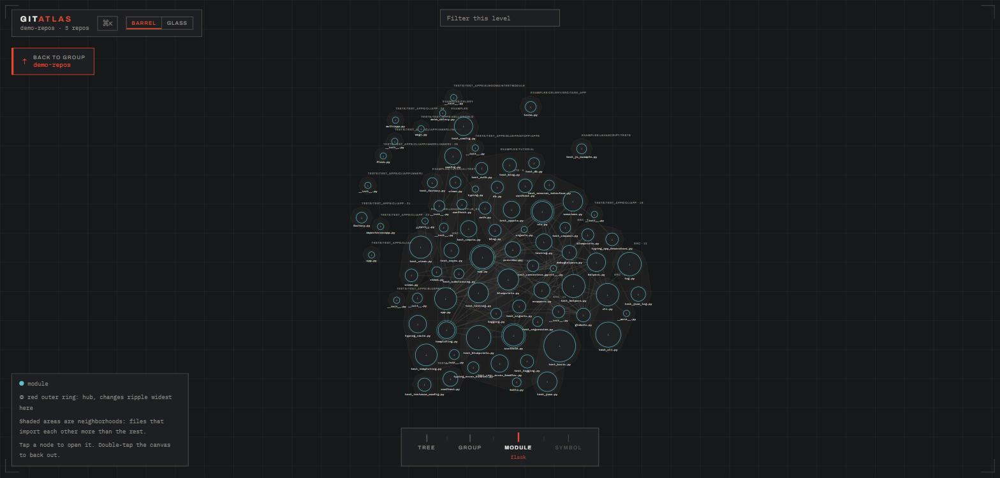
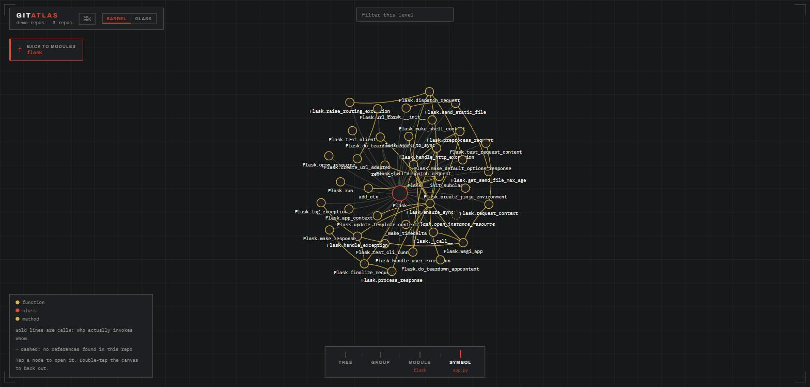
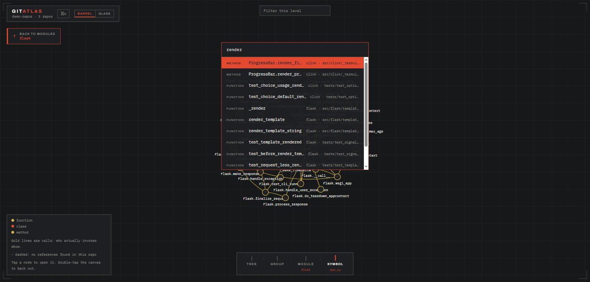

<div align="center">

# gitatlas

**One map. Every repo. Down to the function.**

Point it at a folder of repositories. Get one interactive HTML file that zooms from your whole system, to a repo, to a module, to a single function. No server, no cloud, no account. Your code never leaves your machine.

[](https://github.com/adityaarakeri/gitatlas/actions/workflows/ci.yml)
[](LICENSE)
[](https://nodejs.org)
[](docs/internals.md#honest-limitations)

<picture>
  <source media="(prefers-color-scheme: dark)" srcset="docs/map-modules-dark.jpg">
  <source media="(prefers-color-scheme: light)" srcset="docs/map-modules-light.jpg">
  
</picture>

<sub>Real output: `flask`, `click`, and `jinja` in one map. 216 modules, 4,083 symbols, 6,679 edges.</sub>

</div>

---

## Why

Agents write the code now. Somebody still has to understand it.

Writing code stopped being the bottleneck. Understanding a codebase you did not write, and increasingly that *nobody* wrote, is the expensive part. Your architecture diagram describes a company you no longer work at, and the one person who understood billing left in March.

gitatlas makes the map a file. One command, one HTML file, openable by anyone from the intern to the VP.

## Quick start

Requires Node 22 or newer. No native builds, no database, no daemon.

```bash
git clone https://github.com/adityaarakeri/gitatlas && cd gitatlas
npm install
npm run extract -- /path/to/your/repos
```

Open the `index.html` it prints at the end. That is the whole install.

> Not published to npm yet, so the clone is the install. `npm i -g gitatlas` and `brew install` land with the first release. See [PUBLISH.md](PUBLISH.md).

No repos handy? The bundled fixtures work:

```bash
npm run extract -- fixtures && open fixtures/.gitatlas/index.html
```

## What you get

Four zoom levels, and the camera flies between them.

| | |
|---|---|
| **Tree** | Every repo, directory, and file on one page, folding and unfolding |
| **Group** | Repos as nodes |
| **Module** | Files, their imports, shaded neighborhoods, red-ringed hubs |
| **Symbol** | Functions, classes, methods, inheritance, and gold call edges |



<sub>Symbol level inside `flask/app.py`. Gold lines are calls: who actually invokes whom.</sub>

**Neighborhoods are computed, not filed.** Shaded regions group files that lean on each other and touch the rest lightly. When a `utils` file has quietly become load-bearing for billing, it shows up inside the billing neighborhood no matter which folder it lives in.

**Hubs are where change ripples widest.** A red ring marks the modules far above typical connection count. First place to look before a refactor, last place to edit casually on a Friday.

**Press ⌘K and go anywhere.** Type a few letters of any repo, file, class, or function across the entire group, and the camera flies to it. Hovering any node dims everything except its direct connections, so you can trace one module's wiring through a dense map without losing your place.



## Feed it to your coding agent

Agents are brilliant sprinters with amnesia. Every session yours greps around, rebuilds a mental model from scratch, and bills you for it. Hand it the map instead.

```bash
gitatlas brief --budget 1500     # token-budgeted markdown digest for a system prompt
```

```bash
claude mcp add gitatlas -- gitatlas mcp --out /path/to/repos/.gitatlas
```

The MCP server exposes five tools over stdio: `brief`, `scope` (stack trace to ranked suspects), `find_symbol`, `module_info`, and `check_freshness`. It re-verifies source fingerprints before every answer, so an agent is never handed stale `file:line` data without a warning inside the result.

A map that has drifted from the code is worse than no map. `gitatlas check` exits 1 when anything is stale, and `gitatlas extract --if-stale` is the one-liner for CI jobs and agent hooks.

Details in [docs/agents.md](docs/agents.md).

## Three rules it will not break

1. **The schema is the contract.** Extractor and viewer never know about each other.
2. **Artifacts are files.** No daemon, no database, no required network.
3. **Every edge carries confidence.** `exact`, `resolved`, or `inferred`. Guesses are drawn dashed and labeled. Nothing is upgraded to a fact.

Nothing comes from a language model. When `helper()` could be three different symbols, gitatlas emits no edge rather than a wrong one. Same repos in, pixel-identical map out, every run.

## How it compares

| | Scope | Who authors the model | Output |
|---|---|---|---|
| **gitatlas** | a folder of repos | the extractor | one local HTML file |
| GitNexus, CodeGraph | one repo per graph | the extractor | a graph for agents |
| Structurizr | whatever you declare | you, by hand | rendered C4 diagrams |
| Sourcegraph | org-wide | the indexer | a hosted search UI |

Hand-written models drift the day their author goes on holiday. This one regenerates from the code.

## Commands

| Command | What it does |
| --- | --- |
| `gitatlas extract <folder>` | Build the map |
| `gitatlas check <folder>` | Exit 0 fresh, 1 stale |
| `gitatlas brief` | Token-budgeted digest for agent context |
| `gitatlas mcp` | Serve the map to agents over MCP |
| `gitatlas scope` | Rank the neighborhood around a bug signal |
| `gitatlas site` | Hosted playground for public GitHub repos |

Full flags, repo discovery, submodule modes, and ignore globs: [docs/cli.md](docs/cli.md).

## Honest limitations

- **21 languages**, but call edges resolve in 14 of them so far. The rest still get symbols, imports, and inheritance.
- **No cross-repo edges yet.** Repo A calling repo B over HTTP is invisible to static analysis. The boundary stitcher is next.
- **Unused-symbol rings are a hint, not a verdict.** Matching is name-based and repo-local, so a function consumed from another repo looks lonelier than it is.
- **The viewer's fonts load from Google Fonts.** d3 is vendored in, so the map itself renders offline. Only the type falls back to system faces.

The full list, including the Node 24 V8 flag and per-language privacy conventions, is in [docs/internals.md](docs/internals.md).

## Put it in every repo

Every repo should ship with its own map, the same way it ships with a README.

Copy [`examples/github-action.yml`](examples/github-action.yml) into `.github/workflows/gitatlas.yml` and every push to main regenerates the map as a downloadable artifact. Point the upload step at GitHub Pages instead and it becomes a URL your team can bookmark. (The workflow calls `npx gitatlas`, so it starts working once the package is published.)

## Roadmap

Next: the cross-repo stitcher (HTTP routes and clients, queue topics, shared-package joins), a per-repo touchpoint inventory (env vars, databases, third-party SDKs), watch mode with incremental re-extraction, and proper multi-level clustering if large repos show fragmented neighborhoods.

Already shipped: call edges (0.9.0), precomputed deterministic layout and the command palette (0.8.0), 21 languages (0.7.0), neighborhoods and hubs (0.6.0), the `scope` bug scoper (0.4.0).

## Docs

- [docs/cli.md](docs/cli.md) - every command and flag
- [docs/agents.md](docs/agents.md) - brief, MCP, and freshness
- [docs/internals.md](docs/internals.md) - architecture, determinism, limitations, prior art
- [docs/playground.md](docs/playground.md) - hosted site and cheap deploys

## Contributing

Read [CONTRIBUTING.md](CONTRIBUTING.md). The most valuable contribution right now is a new language extractor, and the doc walks through exactly what one has to emit.

## License

MIT
